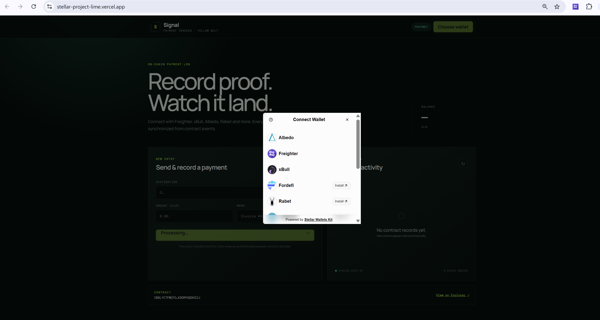
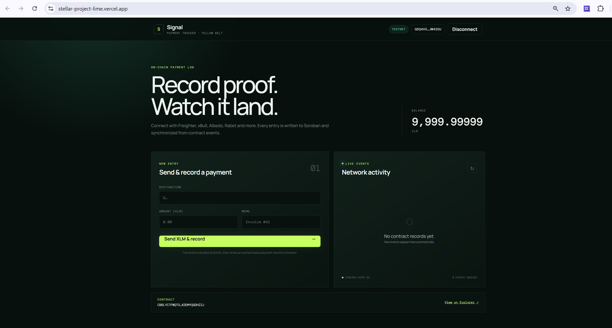
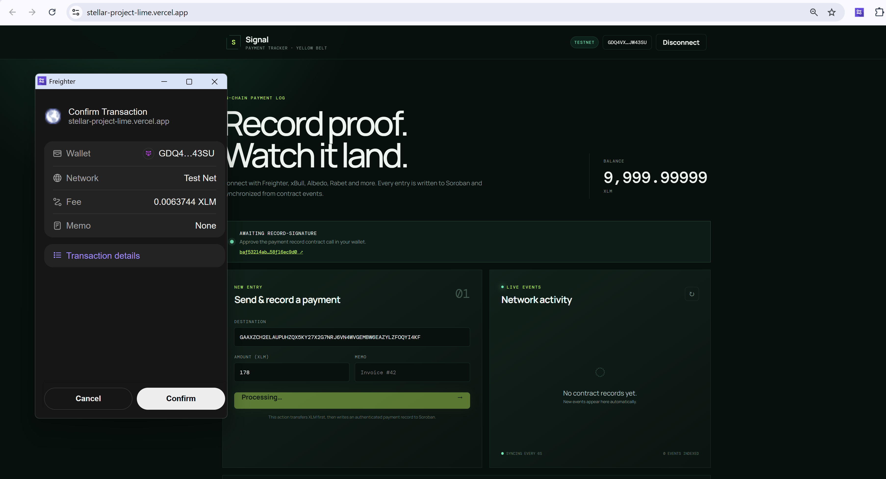
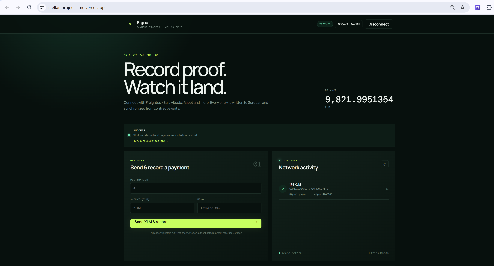
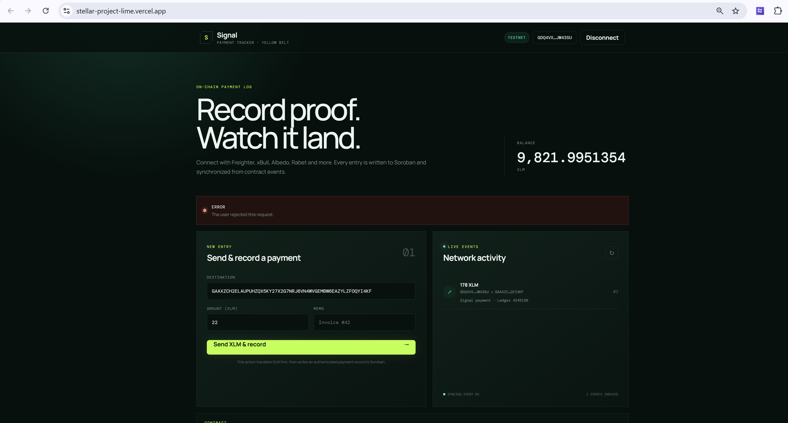
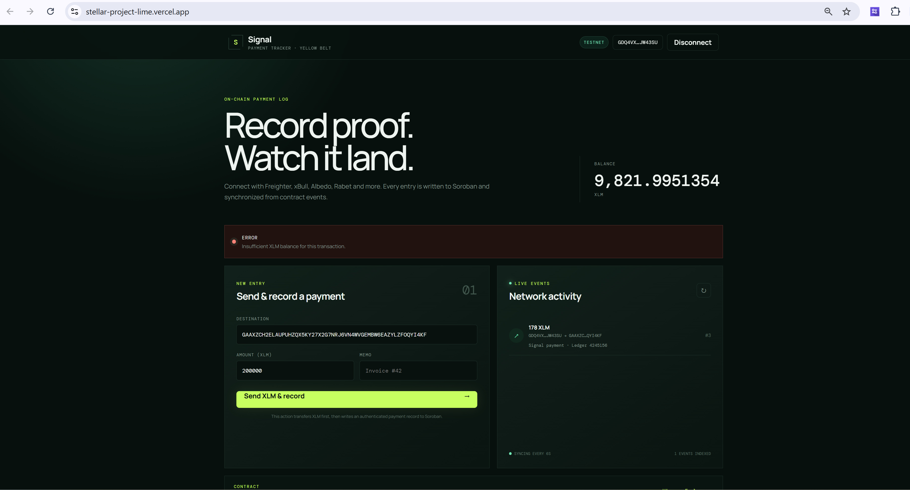
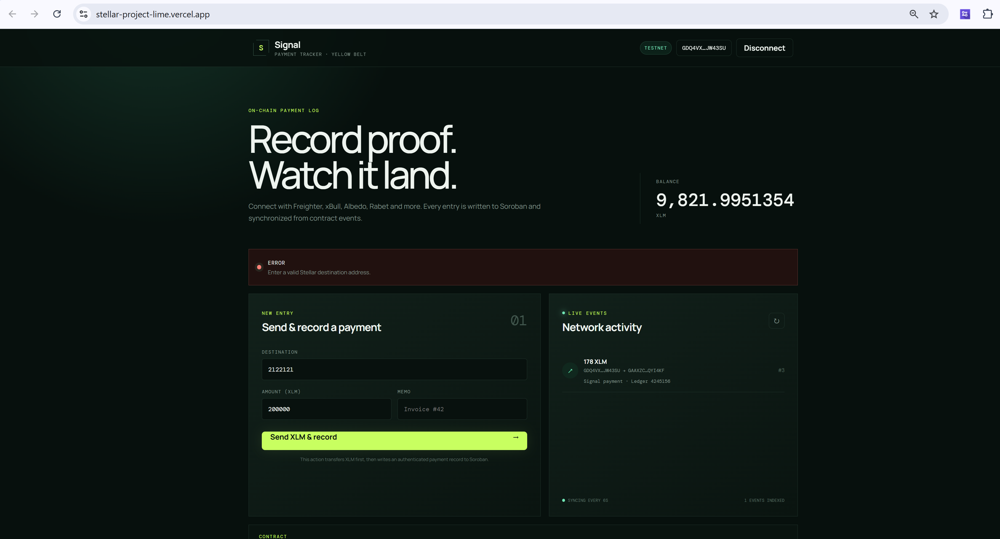

# Signal — Yellow Belt Payment Tracker

Signal is a multi-wallet Stellar Testnet dApp that transfers XLM and records authenticated payment data through a deployed Soroban smart contract. New contract events are synchronized with the live activity feed.

**Live Demo:** https://stellar-project-lime.vercel.app

## Yellow Belt Features

- Multi-wallet integration using Stellar Wallets Kit
- Freighter, xBull, Albedo, Rabet and other compatible wallets
- Rust Soroban smart contract deployed on Testnet
- Smart contract calls from the frontend
- Contract state reading and writing
- Real-time contract event synchronization
- Visible pending, success and failure transaction states
- Actual XLM transfers between Stellar accounts
- Automatic activation of unfunded destination accounts
- Explorer links for transaction verification
- More than 10 meaningful Git commits

## Error Handling

The interface handles and displays readable messages for:

- User-rejected transactions
- Insufficient XLM balance
- Invalid Stellar destination addresses
- Missing or unavailable wallets
- Wrong network
- RPC and on-chain transaction failures
- Confirmation timeouts

## Technology Stack

- React 19
- Vite
- Stellar Wallets Kit
- Stellar SDK
- Rust
- Soroban SDK
- Stellar Horizon and RPC
- Vercel

## Run Locally

```bash
npm install
copy .env.example .env.local
npm run dev
```

Set the deployed Testnet contract in `.env.local`:

```dotenv
VITE_CONTRACT_ID=CB6LYC7FWQTOWHPA3FZRYAOY7QSNUGIPQEN6U3BVCC3YKDDMYQGDHZ2J
```

## Smart Contract

The Rust/Soroban source is located in `contracts/payment-tracker`.

- **Network:** Stellar Testnet
- **Contract ID:** [`CB6LYC7FWQTOWHPA3FZRYAOY7QSNUGIPQEN6U3BVCC3YKDDMYQGDHZ2J`](https://stellar.expert/explorer/testnet/contract/CB6LYC7FWQTOWHPA3FZRYAOY7QSNUGIPQEN6U3BVCC3YKDDMYQGDHZ2J)
- **Verifiable contract transaction:** [`b5fea73178ce5284ccd316c19ff5079fd76b60fcbe94f82eb7a631a95eb9b373`](https://stellar.expert/explorer/testnet/tx/b5fea73178ce5284ccd316c19ff5079fd76b60fcbe94f82eb7a631a95eb9b373)

## Screenshots

### Multi-wallet Options



### Wallet Connected on Testnet



### XLM Transfer Confirmation


### Smart Contract Call Confirmation



### Pending Transaction


### Success and Live Event



## Error Handling Evidence

### User-Rejected Transaction



### Insufficient Balance



### Invalid Destination Address



## Transaction Flow

1. Connect a supported Stellar wallet.
2. Enter a destination, XLM amount and optional memo.
3. Approve the XLM transfer.
4. Approve the Soroban contract record.
5. Follow the pending, success or failure status.
6. See the new record in the live activity feed.

All transactions and contract operations use Stellar Testnet.
