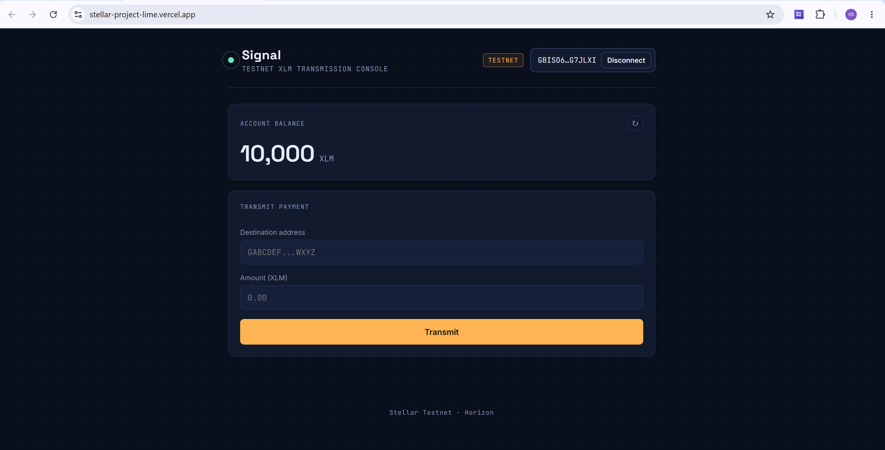
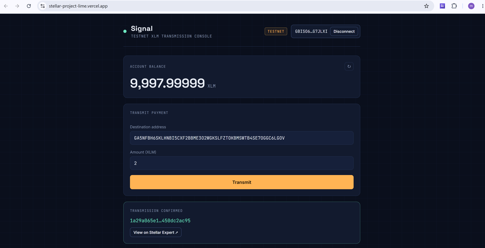

# Signal — Testnet XLM Payment Console

A minimal "mission control" console for connecting a Freighter wallet and sending
XLM payments on the Stellar **testnet**. Built for the White Belt level of the
Stellar Journey to Mastery program.

## What it does

- Connects / disconnects a [Freighter](https://www.freighter.app/) wallet
- Fetches and displays the connected account's live XLM balance
- Sends a native XLM payment to any Stellar public key on testnet
- Shows clear success/failure feedback, including the transaction hash with
  a link to Stellar Expert

## Tech stack

- [React](https://react.dev/) + [Vite](https://vite.dev/)
- [`@stellar/stellar-sdk`](https://www.npmjs.com/package/@stellar/stellar-sdk) — building/submitting transactions, reading Horizon
- [`@stellar/freighter-api`](https://www.npmjs.com/package/@stellar/freighter-api) — wallet connect & transaction signing

## Prerequisites

- Node.js 18+
- The [Freighter](https://www.freighter.app/) browser extension installed
- Freighter's network switched to **Testnet** (Settings → Network)
- A funded testnet account — the app links to [Friendbot](https://friendbot.stellar.org/)
  if your connected account has no balance yet

## Setup — run locally

```bash
# 1. Install dependencies
npm install

# 2. Start the dev server
npm run dev

# 3. Open the printed local URL (usually http://localhost:5173)
```

To create a production build:

```bash
npm run build
npm run preview
```

## How to use it

1. Click **Connect Wallet** and approve the request in Freighter.
2. If Freighter is on the wrong network, the app will ask you to switch to Testnet.
3. Your XLM balance loads automatically. If the account is unfunded, use the
   **Fund with Friendbot** link.
4. Enter a destination public key (starts with `G…`) and an amount, then click
   **Transmit**.
5. Approve the signature prompt in Freighter. The result — success with a
   transaction hash, or a failure reason — appears below the form.

## Project structure

```
src/
  lib/stellar.js          # Wallet + Horizon helpers (connect, balance, send payment)
  components/
    StatusBar.jsx          # Header: brand, network badge, connect/disconnect
    BalancePanel.jsx        # XLM balance readout + Friendbot link
    PaymentForm.jsx          # Destination/amount inputs + validation
    TxResult.jsx              # Success/error feedback panel
  App.jsx                       # Wires everything together
  App.css / index.css           # Design tokens & styling
```

## Notes

- All transactions use `Networks.TESTNET`; the app never touches mainnet.
- "Disconnect" clears the app's local session. Freighter authorizes access
  per-website from inside the extension itself, so to fully revoke access,
  remove the site from Freighter's connected-sites settings.
- Errors from Horizon (e.g. insufficient balance, bad destination) are
  surfaced directly in the transaction result panel.

## Screenshots

> Add screenshots here before submitting:
> - Wallet connected state
> - Balance displayed
> - Successful testnet transaction
> - Transaction result shown to the user




